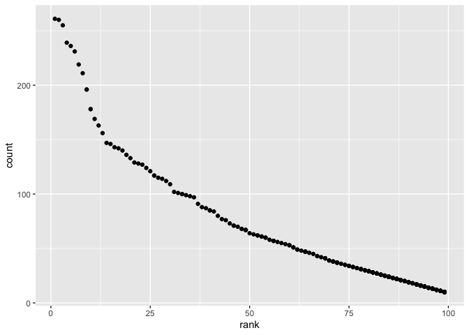

p8105\_hw2\_sz3030
================
Shaocong Zhang
10/9/2021

# Problem 1

## Read and clean the Mr. Trash Wheel sheet

``` r
library(readxl)
library(tidyverse)
```

    ## ── Attaching packages ─────────────────────────────────────── tidyverse 1.3.1 ──

    ## ✓ ggplot2 3.3.5     ✓ purrr   0.3.4
    ## ✓ tibble  3.1.4     ✓ dplyr   1.0.7
    ## ✓ tidyr   1.1.3     ✓ stringr 1.4.0
    ## ✓ readr   2.0.1     ✓ forcats 0.5.1

    ## ── Conflicts ────────────────────────────────────────── tidyverse_conflicts() ──
    ## x dplyr::filter() masks stats::filter()
    ## x dplyr::lag()    masks stats::lag()

``` r
trash.wheel = read_excel("./Trash-Wheel-Collection-Totals-7-2020-2.xlsx",
                          sheet = "Mr. Trash Wheel",
                          range = "A2:N535") %>%
  janitor::clean_names() %>%
  drop_na(dumpster) %>%
  mutate(sports_balls = round(sports_balls))
```

## Read and clean precipitation data for 2018 and 2019

``` r
preciptation_2018 = read_excel("./Trash-Wheel-Collection-Totals-7-2020-2.xlsx",
                          sheet = "2018 Precipitation", 
                          skip = 1) %>%
  janitor::clean_names() %>%
  drop_na(month, total) %>%
  mutate(year = 2018)

preciptation_2019 = read_excel("./Trash-Wheel-Collection-Totals-7-2020-2.xlsx",
                          sheet = "2019 Precipitation", 
                          skip = 1) %>%
  janitor::clean_names() %>%
  drop_na(month, total) %>%
  mutate(year = 2019)
```

## Combine precipitation datasets and convert month to a character variable

``` r
comb_precipitation = bind_rows(preciptation_2018, preciptation_2019) %>%
  mutate(month = month.name[month])
```

For the Mr.Trash Wheel sheet, there are 454 observations and 14
variables. The variables includes information on the dumpster number,
date of collection, amount of total litter and litter type. What’s more,
the median number of sports balls in a dumpster in 2019 was 9.

For the combined precipitation, there are 24 observations and 3
variables. The variables includes information about the year, month and
its total precipitation. What’s more, the total precipitation in 2018 is
70.33

# Problem 2

## First, clean the data in pols-month.csv.

``` r
pols_moth = read_csv("./fivethirtyeight_datasets/pols-month.csv") %>%
  janitor::clean_names() %>%
  separate(mon, into = c("year", "month", "day"), convert = TRUE) %>%
  mutate(month = month.name[month], 
    president = recode(prez_dem, "0" = "dem", "1" = "gop")) %>%
  select(-prez_dem, -prez_gop, -day)
```

    ## Rows: 822 Columns: 9

    ## ── Column specification ────────────────────────────────────────────────────────
    ## Delimiter: ","
    ## dbl  (8): prez_gop, gov_gop, sen_gop, rep_gop, prez_dem, gov_dem, sen_dem, r...
    ## date (1): mon

    ## 
    ## ℹ Use `spec()` to retrieve the full column specification for this data.
    ## ℹ Specify the column types or set `show_col_types = FALSE` to quiet this message.

## Second, clean the data in snp.csv using a similar process to the above.

``` r
year.function = function(dat){
  for (i in 1:nrow(dat)) {
    if(dat$year[i] >= 0 && dat$year[i] <= 15){
      dat$year[i] = 2000 + dat$year[i]
    } else {
      dat$year[i] = 1900 + dat$year[i]
    }
  }
  return(dat)
}

snp = read_csv("./fivethirtyeight_datasets/snp.csv") %>%
  janitor::clean_names() %>%
  separate(date, into = c( "month", "day","year"), convert = TRUE) %>%
  year.function() %>%
  arrange(year, month) %>%
  mutate(month = month.name[month]) %>%
  select(year, month, close) 
```

    ## Rows: 787 Columns: 2

    ## ── Column specification ────────────────────────────────────────────────────────
    ## Delimiter: ","
    ## chr (1): date
    ## dbl (1): close

    ## 
    ## ℹ Use `spec()` to retrieve the full column specification for this data.
    ## ℹ Specify the column types or set `show_col_types = FALSE` to quiet this message.

## Third, tidy the unemployment data so that it can be merged with the previous datasets.

``` r
unemployment = read_csv("./fivethirtyeight_datasets/unemployment.csv") %>%
  pivot_longer(Jan:Dec, names_to = "month", values_to = "unemployment") %>%
  mutate(month = recode(month, Jan = "January", Feb = "February",
                        Mar = "March", Apr = "April",
                        May = "May", Jun = "June",
                        Jul = "July", Aug = "August",
                        Sep = "September", Oct = "October",
                        Nov = "November", Dec = "December")) %>%
  rename(year = Year)
```

    ## Rows: 68 Columns: 13

    ## ── Column specification ────────────────────────────────────────────────────────
    ## Delimiter: ","
    ## dbl (13): Year, Jan, Feb, Mar, Apr, May, Jun, Jul, Aug, Sep, Oct, Nov, Dec

    ## 
    ## ℹ Use `spec()` to retrieve the full column specification for this data.
    ## ℹ Specify the column types or set `show_col_types = FALSE` to quiet this message.

## Join the datasets by merging snp into pols, and merging unemployment into the result.

``` r
comb_prob2 = left_join(pols_moth, snp) %>%
  left_join(., unemployment)
```

    ## Joining, by = c("year", "month")
    ## Joining, by = c("year", "month")

The original pols-month.csv dataset is related to the number of national
politicians who are democratic or republican at any given time. For
pols\_moth dataset, there are 822 observations and 9 variables. The
variables are year(range from 1947 to 2015), month(from January to
December), the number of republican governors on the associated date,
the number of national politicians who are democratic or
republican(gov\_gop, sen\_gop, rep\_gop, gov\_dem, sen\_dem and
rep\_dem) and the sitting president is democratic or republican.

The original snp.csv is related to Standard & Poor’s stock market index.
For the resulting snp dataset, there are 787 observations and 3
variables. The variables are year(range from 1950 to 2015) and the
closing values of the S&P stock index on the associated date.

The original unemployment.csv dataset is related to the percentage of
unemployment of the associated year in months. For the resulting
unemployment dataset, there are 816 observations and 3 variables. The
variables are years(range from 1948 to 2015), month(from January to
December) and the unemployment percentage.

The merged dataset comb\_prob2 has 822 observations and 11 variables.
The dataset contains all of the variables above

# Problem 3

## Load and tidy the data

By looking through the dataset, we can see that the names of a
categorical predictor and the case structure of string variables changed
over time when comes to year 2012 and the former. For example, “BLACK
NON HISPANIC” of Ethnicities in 2016 while “BLACK NON HISP” in 2012,
name “Aleksandra” in 2013 contrast with “ALEKSANDER” in 2012.

``` r
popular_baby_names = read_csv("./Popular_Baby_Names.csv") %>%
  janitor::clean_names() %>%
  mutate(
    childs_first_name = str_to_title(childs_first_name),
    ethnicity = str_to_lower(ethnicity),
    ethnicity = recode(ethnicity, "asian and paci" = "asian and pacific islander",
                       "black non hisp" = "black non hispanic",
                       "white non hisp" = "white non hispanic")
  ) %>%
   distinct() %>% 
   arrange(year_of_birth, ethnicity, rank)
```

    ## Rows: 19418 Columns: 6

    ## ── Column specification ────────────────────────────────────────────────────────
    ## Delimiter: ","
    ## chr (3): Gender, Ethnicity, Child's First Name
    ## dbl (3): Year of Birth, Count, Rank

    ## 
    ## ℹ Use `spec()` to retrieve the full column specification for this data.
    ## ℹ Specify the column types or set `show_col_types = FALSE` to quiet this message.

``` r
distinct(popular_baby_names, ethnicity)
```

    ## # A tibble: 4 × 1
    ##   ethnicity                 
    ##   <chr>                     
    ## 1 asian and pacific islander
    ## 2 black non hispanic        
    ## 3 hispanic                  
    ## 4 white non hispanic

## Produce a well-structured, reader-friendly table showing the rank in popularity of the name “Olivia” as a female baby name over time; this should have rows for ethnicities and columns for year.

``` r
popular_baby_names %>%
  filter(childs_first_name == "Olivia", gender == "FEMALE") %>%
  select(year_of_birth, ethnicity, rank) %>% 
  pivot_wider(names_from = "year_of_birth", values_from = "rank")
```

    ## # A tibble: 4 × 7
    ##   ethnicity                  `2011` `2012` `2013` `2014` `2015` `2016`
    ##   <chr>                       <dbl>  <dbl>  <dbl>  <dbl>  <dbl>  <dbl>
    ## 1 asian and pacific islander      4      3      3      1      1      1
    ## 2 black non hispanic             10      8      6      8      4      8
    ## 3 hispanic                       18     22     22     16     16     13
    ## 4 white non hispanic              2      4      1      1      1      1

## Produce a similar table showing the most popular name among male children over time.

``` r
popular_baby_names %>% 
  filter(gender == "MALE", rank == 1) %>% 
  select(year_of_birth, ethnicity, childs_first_name) %>% 
  pivot_wider(names_from = year_of_birth, values_from = childs_first_name)
```

    ## # A tibble: 4 × 7
    ##   ethnicity                  `2011`  `2012` `2013` `2014` `2015` `2016`
    ##   <chr>                      <chr>   <chr>  <chr>  <chr>  <chr>  <chr> 
    ## 1 asian and pacific islander Ethan   Ryan   Jayden Jayden Jayden Ethan 
    ## 2 black non hispanic         Jayden  Jayden Ethan  Ethan  Noah   Noah  
    ## 3 hispanic                   Jayden  Jayden Jayden Liam   Liam   Liam  
    ## 4 white non hispanic         Michael Joseph David  Joseph David  Joseph

## Finally, for male, white non-hispanic children born in 2016, produce a scatter plot showing the number of children with a name (y axis) against the rank in popularity of that name (x axis).

``` r
popular_baby_names %>%
  filter(gender == "MALE", ethnicity == "white non hispanic", year_of_birth == 2016) %>%
  ggplot(aes(x = rank, y = count)) + geom_point()
```

<!-- -->
